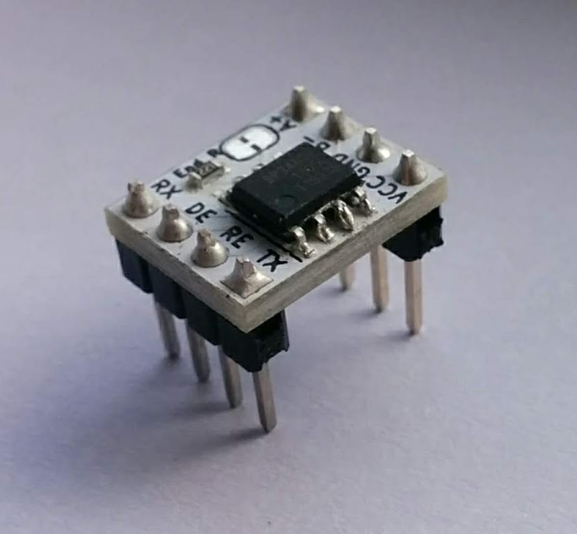

# sp3485-breakout



## Setup

To install submodules, run the following command after clone.

```
git submodule update --init --recursive
```

## License

MIT

## References

- [Sparkfun Transceiver Breakout](https://www.sparkfun.com/products/10124)
- [Sparkfun Transceiver Breakout schematic (PDF)](https://cdn.sparkfun.com/datasheets/BreakoutBoards/RS485_Breakout_v10.pdf)
